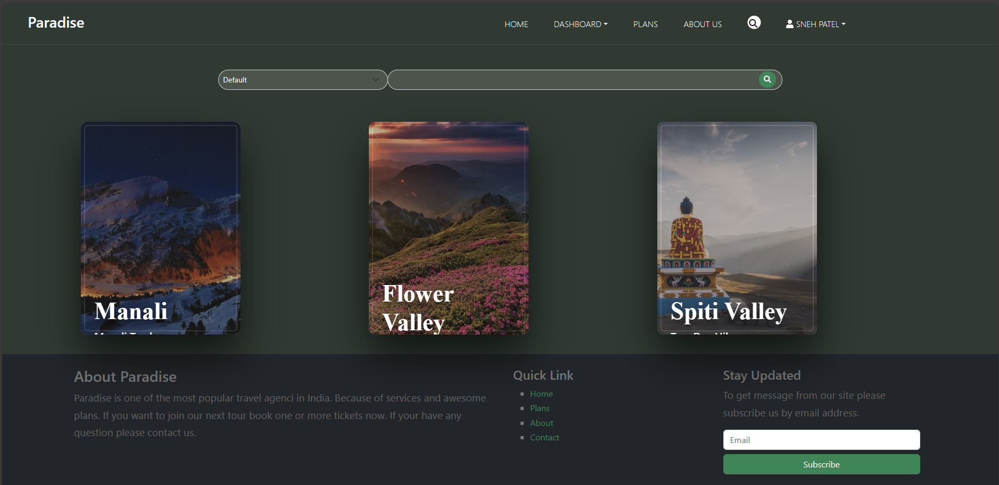
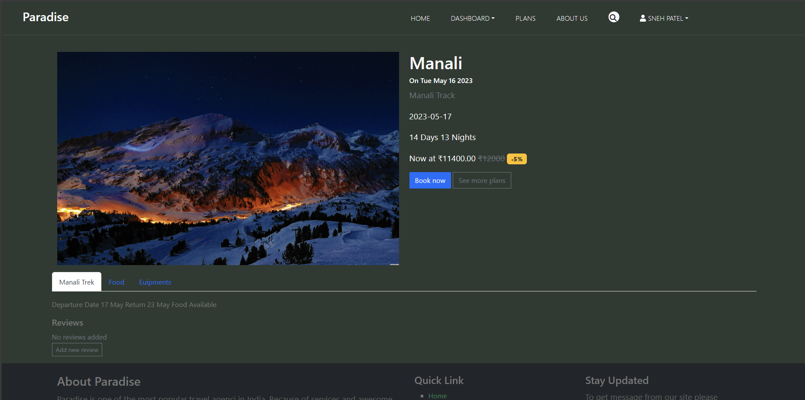
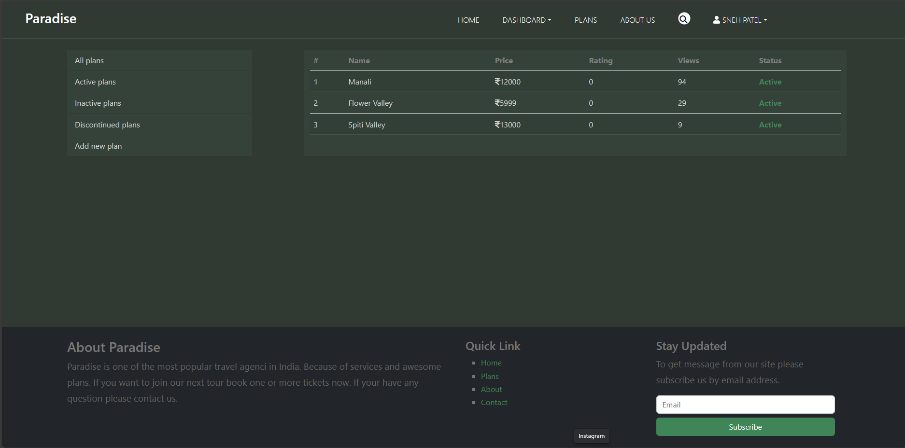
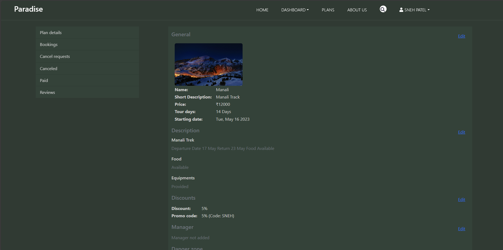

# Paradise - Trekking Travel Booking Site

Welcome to **Paradise**, a travel booking site designed for trekking enthusiasts. This project features three distinct panels for Admin, Manager, and User roles, allowing for efficient management and booking of trekking plans. Admin and Manager have access to plan management, while Users can book trekking plans.

## Sneak Peek

Here's a preview of what the Paradise travel booking site looks like:

### Application Interface
<div align="center">
    
</div>

### Plans
<div align="center" style=" margin: 40px;">
    
    
</div>


### Admin Panel
<div align="center" style=" margin: 40px;">
    
    
</div>


## Table of Contents
1. [Project Overview](#project-overview)
2. [Features](#features)
3. [Tech Stack](#tech-stack)
4. [Installation & Setup](#installation--setup)

## Project Overview
Paradise is a MERN stack-based travel booking platform designed for trekking. It allows administrators to create, activate/deactivate, manage plans, set prices, manage dates, and create discount coupons. Managers can manage plans but cannot create new ones. Users can browse and book available plans for trekking.


## Features
- **Admin Panel**:
  - Create new trekking plans.
  - Activate/Deactivate plans.
  - Update plan details (price, dates, etc.).
  - Manage discount coupons.

- **Manager Panel**:
  - Manage existing trekking plans.
  - Cannot create new plans but can perform other administrative tasks.

- **User Panel**:
  - Browse and book trekking plans.
  - Apply discount coupons.

## Dependencies
### Backend

 [](https://www.npmjs.com/package/colors)
[](https://www.npmjs.com/package/cors)
[](https://www.npmjs.com/package/dotenv)
[](https://expressjs.com/)
[](https://www.npmjs.com/package/firebase-admin)
[](https://www.npmjs.com/package/mongodb)
[](https://www.npmjs.com/package/validator)


### Frontend
[](https://www.npmjs.com/package/axios)
[](https://getbootstrap.com/)
[](https://www.npmjs.com/package/firebase)
[](https://www.npmjs.com/package/history)
[](https://jquery.com/)
[](https://react.dev/)
[](https://www.npmjs.com/package/react-bootstrap)
[](https://www.npmjs.com/package/react-dom)
[](https://www.npmjs.com/package/react-hook-form)
[](https://www.npmjs.com/package/react-router-dom)
[](https://www.npmjs.com/package/react-scripts)


## Installation and Development

Paradise requires [Node.js](https://nodejs.org/) to run.

Install the dependencies and devDependencies and start.

### _Frontend_

```sh
# client
cd Paradise/Frontend/
npm install
npm start
```

### _Backend_

```sh
# server
cd Paradise/Server/
npm install
```
### Environment variables

Before starting, the servers must set up some environment variables on both the `Paradise/Frontend` and `Paradise/Server`.

#### _Frontend_

Enter all variables in the `Frontend/.env.local` file.

| Variables | Description |
| ------ | ------ |
| REACT_APP_FIREBASE_APIKEY | Firebase api key |
| REACT_APP_FIREBASE_AUTHDOMAIN | Firebase auth domain |
| REACT_APP_FIREBASE_PROJECTID | Firebase project ID |
| REACT_APP_FIREBASE_STORAGEBUCKET | Firebase storage bucket |
| REACT_APP_FIREBASE_MESSAGINGSENDERID | Firebase messaging sender ID |
| REACT_APP_FIREBASE_APPID | Firebase APP ID |
| REACT_APP_SERVER_BACKEND_API_URL | Server side URL of birdseye |


#### _Backend_

Enter all variables in the `Server/.env` file.

| Variables | Description |
| ------ | ------ |
| PORT | Port number for local |
| LOCAL_URI | MongoDB uri for local |
| DEV_URI | MongoDB uri for development |
| PRODUCTION_URI | MongoDB uri for production |
| FIREBASE_SERVICE_ACCOUNT_INFO | Firebase service account information |

    